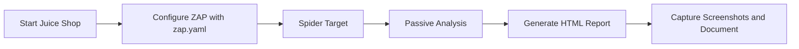
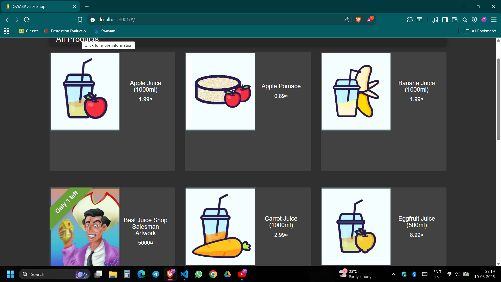
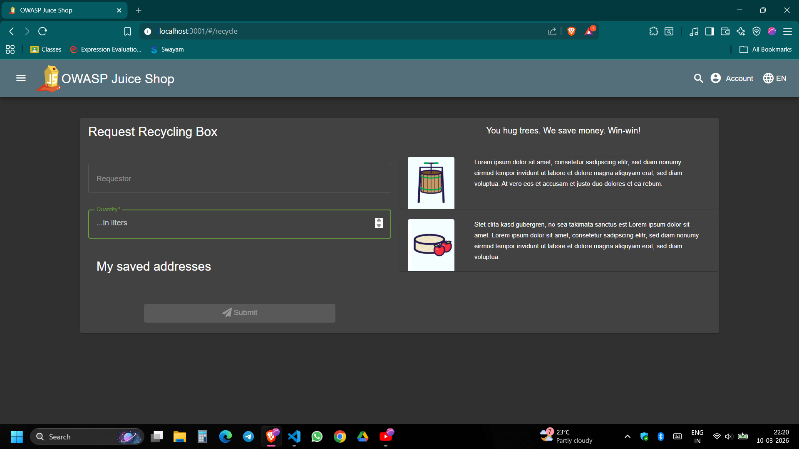
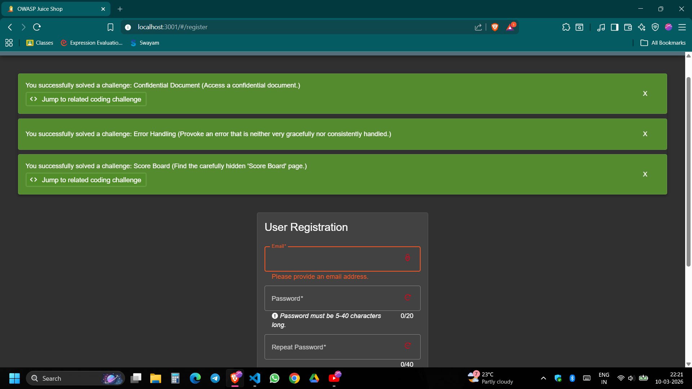
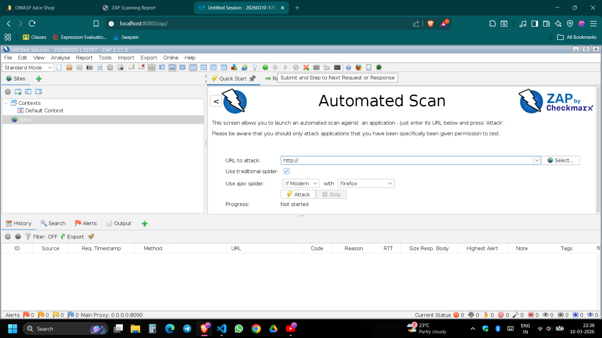
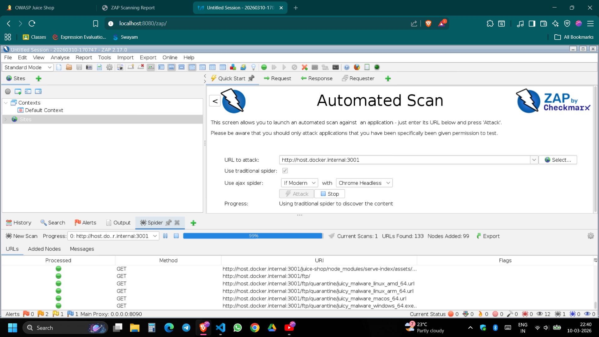
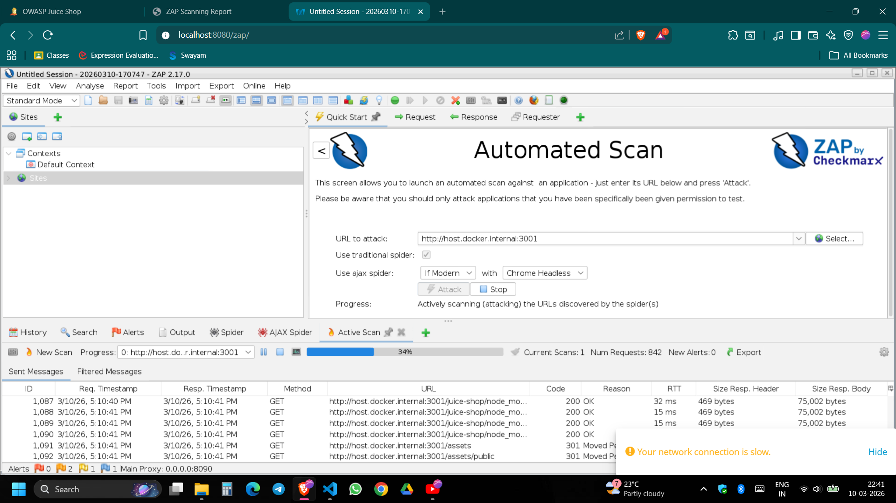
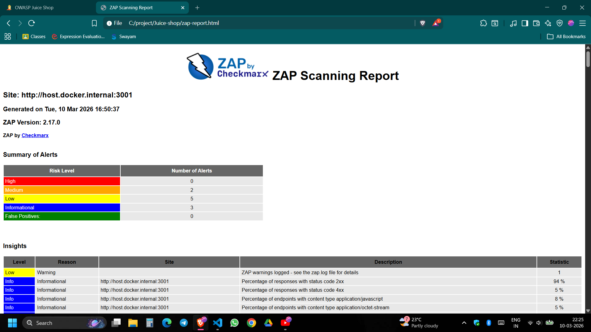
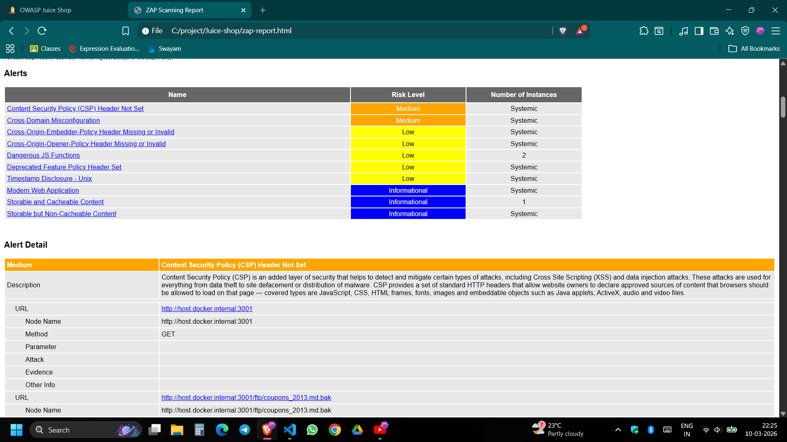
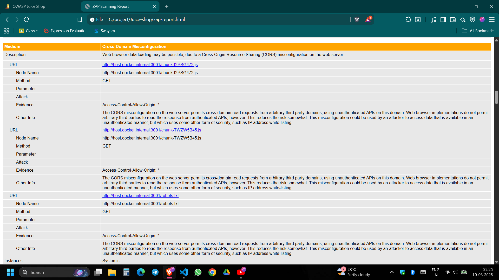

<div align="center">

# OWASP Juice Shop Security Scan Journal
### Creative walkthrough of how the scan was built, executed, and documented

<p>
  
  
  
</p>

</div>

## What this project contains

This repository is a complete record of a ZAP-based security scan run against OWASP Juice Shop.
It includes:

- `zap.yaml` (automation configuration)
- `zap-report.html` (final generated report)
- `images/` (step-by-step screenshots)
- `README.md` (process + explanation + commands)

## Scan Story in One View



## Terminal-Verified Scan Facts

These values were fetched from local files using terminal commands:

- Site: `http://host.docker.internal:3001`
- Generated on: `Tue, 10 Mar 2026 16:50:37`
- ZAP Version: `2.17.0`
- Alert Counts: High `0`, Medium `2`, Low `5`, Informational `3`, False Positives `0`

## Proper Commands Used (with explanation)

### 1. Run Juice Shop locally

```powershell
docker run --rm -p 3001:3000 bkimminich/juice-shop
```

Why: starts the vulnerable target app on local port `3001`.

### 2. Run ZAP using automation file

```powershell
docker run --rm -t -v "${PWD}:/zap/wrk/:rw" ghcr.io/zaproxy/zaproxy:stable zap.sh -cmd -autorun /zap/wrk/zap.yaml
```

Why: executes the full scan pipeline from `zap.yaml` and writes report output into the current project folder.

### 3. Open the HTML report

```powershell
start zap-report.html
```

Why: launches the generated scan report in browser for review.

## Commands Used to Fetch and Verify Report Data

```powershell
Get-Content zap.yaml
Select-String -Path zap-report.html -Pattern "Generated on|ZAP Version|Site:"
```

Why: confirms target URL, report timestamp, and scanner version directly from the generated artifacts.

```powershell
$c=Get-Content zap-report.html; $c[226..273]
```

Why: extracts the exact "Summary of Alerts" section to verify risk counts from the report source.

## How it was implemented

`zap.yaml` job order:

1. `passiveScan-config`: sets passive scan behavior and tags.
2. `spider`: crawls the target (`maxDuration: 1`) to discover reachable endpoints.
3. `passiveScan-wait`: waits until passive checks are complete.
4. `outputSummary`: prepares long-format summary output.
5. `report`: generates `zap-report.html` with traditional template.

## Findings Summary

| Risk Level | Alerts |
|---|---:|
| High | 0 |
| Medium | 2 |
| Low | 5 |
| Informational | 3 |
| False Positives | 0 |

## Visual Process Evidence

### Application pages explored

<table>
  <tr>
    <td align="center"><br/>All Products</td>
    <td align="center"><br/>Recycle Page</td>
    <td align="center"><br/>Registration Page</td>
  </tr>
</table>

### ZAP scanning stages

<table>
  <tr>
    <td align="center"><br/>Automated Scan Setup</td>
    <td align="center"><br/>Spider Progress</td>
    <td align="center"><br/>Active Scan Progress</td>
  </tr>
</table>

### Final report snapshots

<table>
  <tr>
    <td align="center"><br/>Summary</td>
    <td align="center"><br/>Alert List</td>
    <td align="center"><br/>Alert Detail</td>
  </tr>
</table>

## Notes

- This setup is for legal security learning and documentation.
- OWASP Juice Shop is intentionally vulnerable, so findings are expected.
- You can now push this repository with clear proof of process, implementation, commands, and outcomes.
